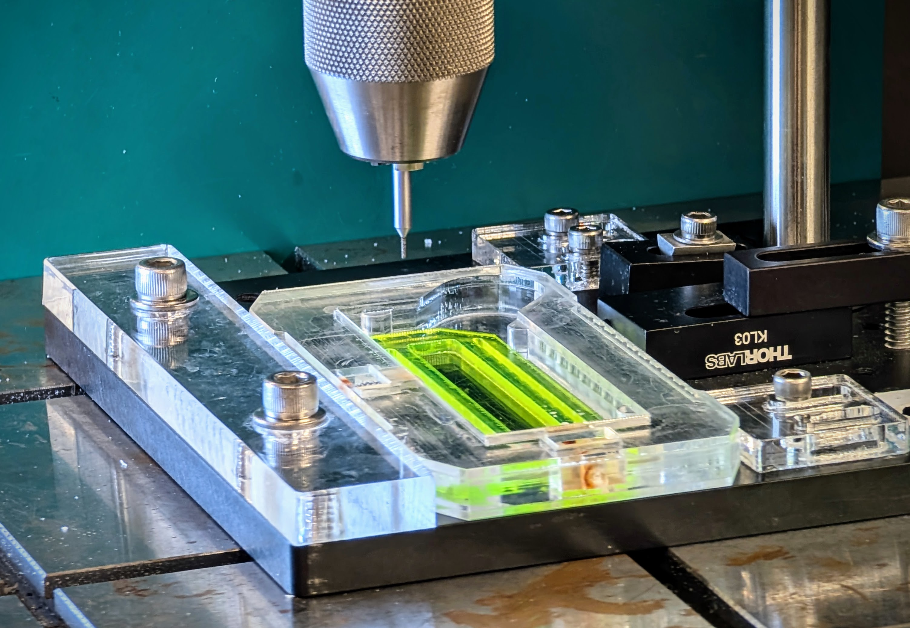

# Indexed Slide Drilling Fixture for Quartz Microfluidic Slides

## Motivation

Drilling precise, evenly spaced holes in quartz slides for microfluidic applications is challenging due to the risk of slide flexing, misalignment, and surface damage. Commercial solutions are limited and often lack the flexibility for custom layouts.

**Benefits of this custom-made indexed slide drilling fixture:**

* Rigid, reproducible slide positioning using three reference protrusions and two spring-loaded plungers
* Indexed gear rack mechanism with external spring-loaded plunger enables accurate, repeatable linear movement between hole positions
* Water-filled slide pocket for cooling and debris reduction during drilling
* Cutout beneath the imaging region prevents scratching of the slide surface
* Parametric CAD design allows rapid adjustment of hole pitch and number of fluidic channels for custom microfluidic layouts
* Can be fabricated quickly from stacked, laser-cut acrylic sheets and standard hardware

## Folder Structure

- **cad/** → CAD models
  - **parts/commercial/** → Purchased parts: 3D models, drawings, datasheets, etc.
  - **asm/** → CAD assemblies

- **bom/** → Bill of materials
  - `bom.xlsx` → List of all parts and materials

- **mfg/** → Manufacturing files
  - **3dp/** → 3D printing models (`.STL`, `.preform`, `.3mf`, `.gcode`, ...)
  - **laser/** → Laser cutting files (`.DXF`, `.SVG`, `.PDF`, `.las`)

- **docs/** → Drawings, datasheets, and assembly guides
  - **dwg/** → Drawings for parts and assemblies (`.PDF`)

- **imgs/** → Images for `README.md`

## Manufacturing

The indexed slide drilling fixture can be fabricated using two alternative methods, depending on available equipment and desired material properties:

### Option A: Laser-Cut Acrylic Assembly

1. **Material:** Acrylic glass sheets (thicknesses: 1/16", 3/32", 7/32", and 1/4")
2. **Equipment:** Universal Laser VLS2.30 (or equivalent laser cutter)
3. **Process:**
   - Use the provided `.PDF` or `.SVG` files (see `mfg/laser/`) to laser cut each layer of the fixture.
   - Align and fuse layers together with dichloromethane for a strong, seamless bond.
   - Install spring-loaded plungers before fusing the top layer.

### Option B: 3D Printed Assembly

1. **Material:** Tough 2000 Resin (Formlabs) or equivalent
2. **Equipment:** Formlabs Form 4 (or equivalent SLA 3D printer)
3. **Process:**
   - Use the provided `.STL` files (see `mfg/3dp/`) to print each fixture component.
   - Post-process printed parts as recommended by the resin manufacturer (wash, cure, etc.).
   - Assemble the fixture by gluing parts together with cyanoacrylate (superglue).
   - Install spring-loaded plungers before fusing the top layer.

**Note:**  
Both manufacturing approaches produce a robust fixture suitable for repeated use. The parametric CAD design can be easily adapted for either method to accommodate different slide formats, hole patterns, or channel pitches.

